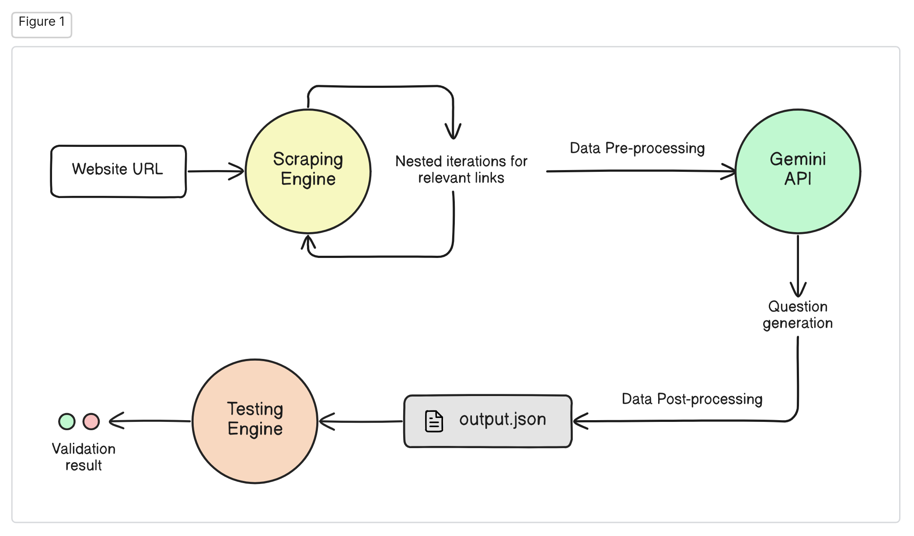

# OOSC LevelUp

Welcome to the **OOSC LevelUp** repository! This project is designed to help you level up your Object-Oriented Software Construction (OOSC) skills. It includes several coding exercises, tutorials, and resources to enhance your understanding of OOSC principles.



__Please refer to `notebook.ipynb` usign Jupyter notebook for better understanding__

## Table of Contents

- [Techstack](#techstack)
- [Installation](#installation)
- [Using Docker](#using-docker)
- [Running the Project](#running-the-project)
- [Project Structure](#project-structure)
- [Contributing](#contributing)
- [License](#license)

## Techstack

Before you get started, ensure you have the following installed on your machine:

- [Git](https://git-scm.com/)
- [Docker](https://www.docker.com/)
- Python 3.8 or later (if not using Docker)
- Gemini API 1.5 Flash

## Installation and Usage

1. Clone the repository:

    ```bash
    git clone https://github.com/navik11/oosc_levelup.git
    cd oosc_levelup
    ```

2. Rename the `envsample` -> `.env` in the root folder


3. Create a python venv and run it (for linux based system):

    ```bash
    python -m venv myenv
    source myenv/bin/activate
    ```

4. If you are not using Docker, make sure you have the required Python packages:

    ```bash
    pip install -r requirements.txt
    ```

5. Run this script to continue without docker:

    ```bash
    python que_generation/main.py
    ```

6. We would recommend you to go through Jupyter Notebook:

    - If using `venv`, please do `pip install notebook`

    ```bash
    jupyter notebook

    # open the `notebook.ipynb` with jupyter
    ```


## Using Docker

__Docker is the recommended way to run this project because it ensures that you have a consistent environment, regardless of your host system.__

## Using Docker

__Docker is the recommended way to run this project because it ensures that you have a consistent environment, regardless of your host system.__

To use Docker for running the project, follow these steps:

1. Go to the que_generation/main.py

2. Uncomment the Docker Code Written Down Below and comment the input line

3. Now Follow the commands

    ```bash
    docker build -t levelup_img .
    docker run -e WEBSITE_URL="https://trumio.ai/" levelup_img
    ```

    This command creates a Docker image named `levelup_img` based on the `Dockerfile` provided in the repository.


    This will execute all the tests within the Docker container, ensuring that they are run in a clean and consistent environment.

Remember to make these changes in the `que_generation/main.py` file and follow the provided commands to run the project using Docker.

## Project Structure

Here is a brief overview of the project structure:

```
oosc_levelup/
│
├── src/                   # Source code for the project
├── tests/                 # Unit tests
├── Dockerfile             # Docker configuration
├── requirements.txt       # Python dependencies
├── README.md              # Project documentation
└── main.py                # Main entry point for the application
```
